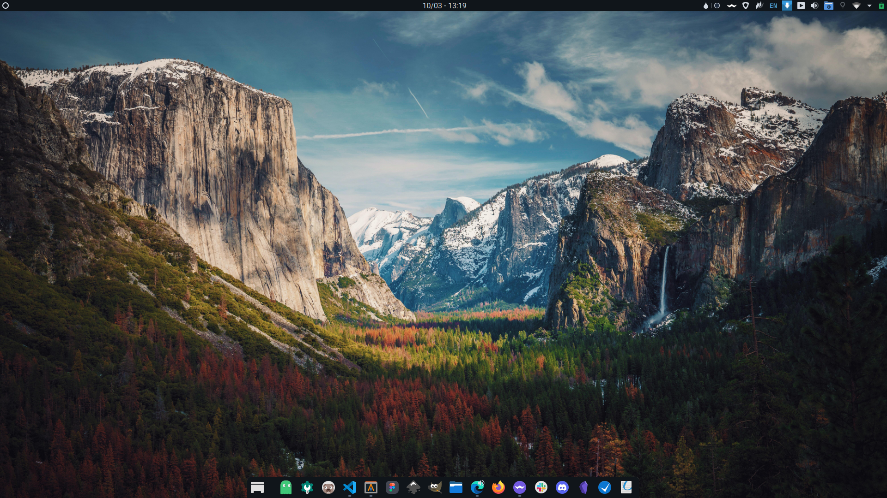

# Arch Linux Installation



## 📦 Installation

1. Install [**_EndeavourOS_**](https://endeavouros.com/latest-release/):

   - Before installing, download [`user_pkglist.txt`](./user_pkglist.txt) and place it in `~/home/liveuser` folder.
   - At _Chossing Desktop Enviroment_ stage:
     - **IF** using _Intel Graphics Card_, uncheck `xf86-video-intel` in `Base Devel > GPU drivers`.
     - Choose **_KDE Desktop_** and remove unnecessary packages:
       - `dragon`.
       - `elisa`.
       - `spectacle`.

2. Post-install:

    - [Create Swap file (max 8 GB)](https://wiki.archlinux.org/title/Swap#Swap_file)
    - [Reduce `vm.swappiness` to `10`](https://wiki.archlinux.org/title/Swap#Swappiness).
    - Adjust `/etc/fstab` using [this sample file](https://gist.github.com/cuongvuong-phoenix/784fe2aef1c062c90010c010e7126a7f).
    - **IF** dual booting, check [this](https://wiki.archlinux.org/title/Dual_boot_with_Windows) for further actions.
    - Install foreign packages using `yay` and [`foreign_pkglist.txt`](./foreign_pkglist.txt):

      ```sh
      yay -S --needed - < foreign_pkglist.txt
      ```

    - [Configure packages](./config-packages.md).

3. Install [**_dotfiles_**](https://github.com/cuongvuong-phoenix/dotfiles).

4. Configure **_KDE_**:

   - [System Settings](./kde-settings.md).
   - **_Plasma Panel_**: add widgets and tasks like the screenshot

## ⚠️ Deprecated

- **_Latte Dock_** (cannot work with _Qt6_ and _KDE 6_)
  - Install required widgets:
    - [**_Event Calendar_**](https://store.kde.org/p/998901).
    - [**_Inline Battery_**](https://store.kde.org/p/1402942) (if using a laptop).
  - Apply layout by using [`phoenix.layout.latte`](./phoenix.layout.latte).
